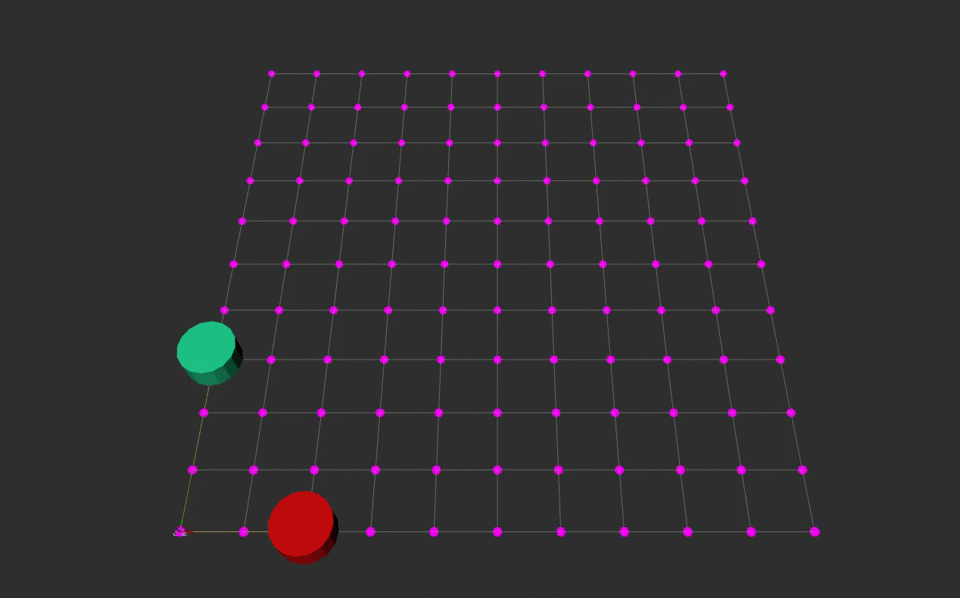
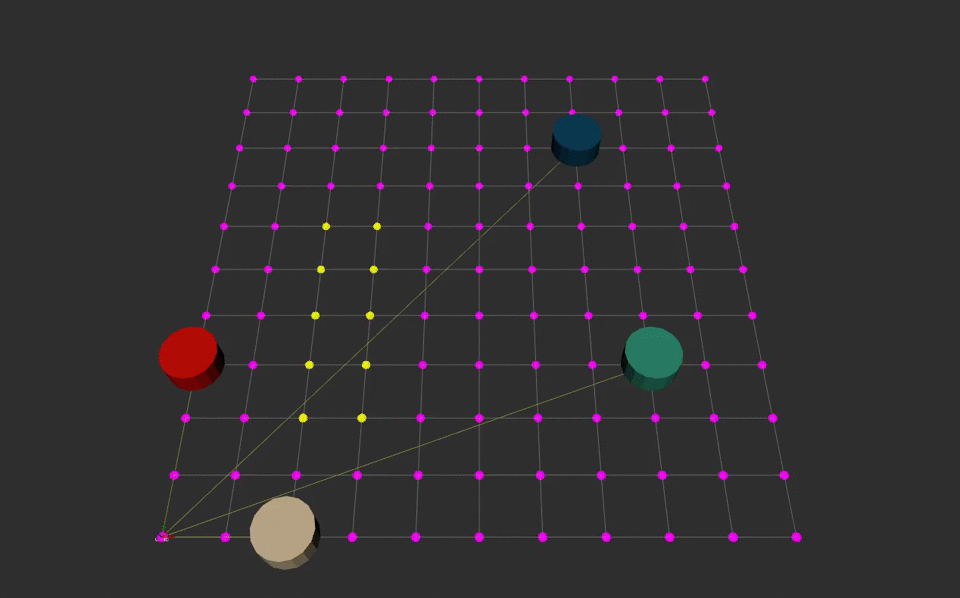
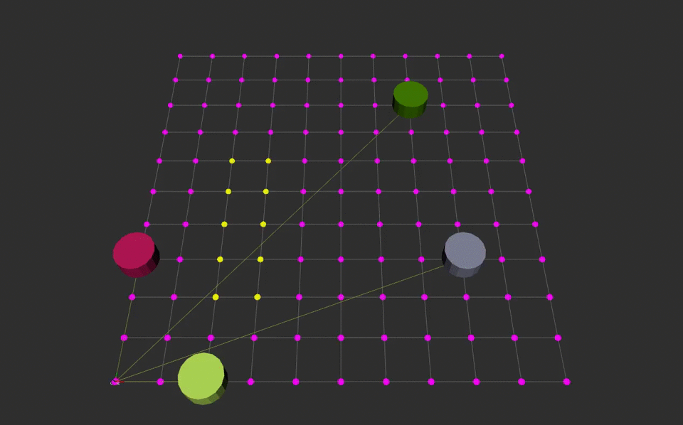

# Multi-agent Path Planner
Created by Solomon Wiznitzer as a solution for a coding challenge.
## Description
**Objective:** To perform motion planning for at least 2 robots (where each robot can only move along the edges between nodes) and display the planned paths in Rviz.

**Overview:** There were four parts to this project.
- *Creating a Roadmap* - This part included configuring Rviz to display a 10x10 grid with (0,0) being at the bottom left corner and (10,10) being at the top right corner. It also entailed drawing a marker representation of all the nodes.
- *Coding the Planner node* - As its name suggests, this involved implementing an algorithm to determine the minimum distance path from a robot's initial starting position to a user-specified goal position. Additionally, the node was responsible for archiving the planned paths so that they could be used for collision detection.
- *Coding the Agent node* - The third part required building a node that would take in a user-specified goal position via a ROS service, request the planned path from the Planner node, and then publish the robot and path markers in Rviz.
- *Testing the system* - In this last part, a launch file was used to start up two robots at specific starting positions. A ROS service hosted by the Agent node was then used (via the Linux Terminal or from the unit tests) to update the goal positions to certain values and watch as the paths were displayed on Rviz.

**System Info:** This package was tested on Ubuntu Linux 16.04 with ROS Kinetic.

### Runtime Instructions
After cloning the repo and building it, just type `roslaunch multi_agent_planner agents.launch` into the terminal to get started. This will launch Rviz and show a 10x10 grid of purple nodes with two colored cylinders (the robots). The colors are randomly generated so if they are too similar in appearance, just `Cntrl-C` and launch the nodes again. By default, *agent_1* (the first robot) is located at position [2,0,0] and *agent_2* (the second robot) is at [0,3,0] (the order is x[m], y[m], yaw[deg]). At startup, you should see three helpful messages printed out to the console confirming that services are running. They are...
```
Motion planner service (/get_plan) is ready.
Ready to update goal pose for agent_1
Ready to update goal pose for agent_2
```
To update the pose for a robot, open up another command terminal and type...
```
rosservice call /agent_x/update_goal
```
and hit tab a couple times ('x' is a placeholder for '1', '2', '3', etc... based on which agent you would like to set the goal pose for). A 'zeroed out' `geometry_msgs::Pose2D` ROS message should appear. Fill it in with whatever pose you so choose as long as the 'x' and 'y' values are integers, and press Enter. If an archived path cannot be found in the Planner node, a message will appear in the terminal saying...
```
Using A* algorithm for agent_x
Algorithm found a path for agent_x
```
This just means that the A\* algorithm implemented in the Planner node was successful in finding a minimum distance path. At this point, the cylinder representing the agent will begin to move as can be seen below.



The above GIF shows the two robots move after making two consecutive calls to the `update_goal` rosservice. The light-pink cylinder represents `agent_1` as it goes from its initial pose of [2,0,0] to [2,5,0]. The green cylinder represents `agent_2` as it goes from its initial pose of [0,3,0] to [6,3,0]. No matter the initial and goal positions, it will always take 10 seconds for the robots to traverse the distance as specified in the challenge. Unfortunately, the GIF does not show this accurately. However, the AVI video clips in the media directory do! So feel free to take a look and time them. Furthermore, the planner node incorporates collision detection in its algorithm so that every agent can traverse its own path at uniform speed over the course of ten seconds. This is why `agent_2` does not travel purely in the horizontal direction. In any event, once each robot arrives at its goal pose, a message is printed out to the terminal saying...
```
Target goal has been reached by agent_x
```
Besides for these messages, there are a few others that will get printed to the user if an invalid goal pose is entered or the user just wants a robot to rotate in place (which it can do! Just it's hard to see with cylindrical robots). However, I will not describe them here.

 ### Extra Features
The following is a list of additional features.
 - Animating the motion of the robots from the start to goal poses, including rotation
 - Designing for scalability; there is no reason more agents cannot be inserted. All that would need to be done is to add another `agent_node` to the launch file and another Marker display in Rviz.
 - The system can work with obstacles in the grid as well.
 - Both nodes were implemented as objects in code. As a result, it is a simple matter of changing a parameter or two in the constructor to make the grid larger or smaller, change the `edge_cost` value, or change the speed it takes for a robot to traverse the path.
 - Testing the system via unit tests (using rostest/gtest). The unit tests call the `update_goal` rosservice automatically with pre-configured goal poses. Besides for animating the agents in Rviz, it also checks to make sure that the planned paths are correct. To run the tests, just type `rostest multi_agent_planner agents.test` in the command terminal.

 Just for fun, I decided to run the system with four agents. Below is a GIF showing the result. The yellow nodes represent obstacles in the world. A video of this can be found in the `media` directory. Note how the brown agent is also rotating (in this case, 180 degrees).

 

 Here is another GIF that also shows the system working with four agents. However, in this case, I purposely generated goal poses that could cause collisions if not handled properly. This can really be seen in the case of the green and gray agents. Without the collision detection feature, the paths generated for both of these agents would have led the agents to go as far left as possible before making them go down towards the bottom of the grid (since my implementation of the A* algorithm breaks ties by choosing the node with the lower 'x' value).

 

 ### ROS Node Info

 - **motion_planner_node:** Responsible for calculating the minimum distance path
     - *Published Topic:* /agent_x/visualization/grid_nodes_free --- message type: Marker
     - *Published Topic:* /agent_x/visualization/grid_nodes_occupied --- message type: Marker
     - *Subscribed Topic:* /agent_feedback --- message type: [agent_info](msg/agent_info.msg)
     - *Service:* Server - /get_plan --- service type: [get_plan](srv/get_plan.srv)
     - *Files:* [motioin_planner_node.cpp](src/motion_planner_node.cpp), [motion_planner_obj.cpp](src/motion_planner_obj.cpp), [motion_planner_obj.h](motion_planner_obj.h)

 - **agent_node:** Responsible for displaying the path and publishing the pose of the agent
     - *Published Topic:* /agent_x/visualization/base_link -- message type: Marker
     - *Published Topic:* /agent_x/visualization/path --- message type: Marker
     - *Published Topic:* /agent_feedback --- message type: [agent_info](msg/agent_info.msg)
     - *Service:* Client - /get_plan --- service type: [get_plan](srv/get_plan.srv)
     - *Service* Server - /agent_x/update_goal -- service type: [update_goal](srv/update_goal.srv)
     - *Files:* [agent_node.cpp](src/agent_node.cpp), [agent_obj.cpp](src/agent_obj.cpp), [agent_obj.h](agent_obj.h)

### Future Work

Although this package contains a good amount of features, there are a couple things that can make it even better. For example, right now, it is not so easy to add obstacles into the world. However, adding another service in the *motion_planner_node* to take in two integers describing a node position and which would subsequently modify the grid could be a solution. Secondly, more unit tests could be created to make sure the algorithm works as expected for various starting and goal poses.
